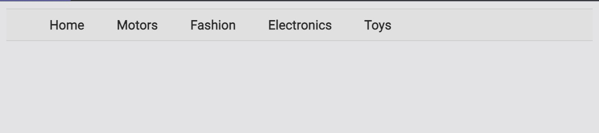

# Styling Conventions

This lesson is a small guide to styling techniques and conventions that we'll be using to design our top-level menu.

## We'll cover the following

- Targetting the elements
- Styling with CSS
- REM and padding
- Adding hover style
- A look at our changes

## Targetting the elements

We have some divs for grouping; now, let’s make them targetable so we can actually do things with them. There are a variety of ​conventions to follow for naming our div classes, and in the end, it doesn’t matter which of them you pick – as long as you’re consistent with one.

We’ll use a convention called BEM for our projects since I think it’s easy to understand.

```html
<html>
  <head> </head>
  <body>
    <div class="menu">
      <div class="menu__item menu__item--home">Home</div>
      <div class="menu__item menu__item--motors">Motors</div>
      <div class="menu__item menu__item--fashion">Fashion</div>
      <div class="menu__item menu__item--electronics">Electronics</div>
      <div class="menu__item menu__item--toys">Toys</div>
    </div>
  </body>
</html>
```

The outermost div is called menu, and each item within it gets a menu\_\_item class. This allows us to target all the items at once, like if we wanted to add a border to each. The modifier --specificCategory is for more specific targeting, like when you hover over “motors” and want to get the submenu specific for “motors”.

## Styling with CSS

Now that we’ve assigned identifiers for everything, we can style it to look like a menu. Since we’re lining these elements up in a horizontal orientation, we know immediately we can use display: inline-block (there are other ways to horizontally align elements, like float and using tables, but for most cases, this one will be the simplest approach). Applying this property to a div essentially lets it behave like a default div (block) without the enforcement that each div be on its own line.

The only other property enabled at all times on this menu is the border. There appears to be thin top and bottom borders, so we’ll just pick a light grey color for those.

### Output below



```html
<html>
  <head>
    <link
      href="https://fonts.googleapis.com/css?family=Roboto"
      rel="stylesheet"
    />
  </head>
  <body>
    <div class="menu">
      <div class="menu__item menu__item--home">Home</div>
      <div class="menu__item menu__item--motors">Motors</div>
      <div class="menu__item menu__item--fashion">Fashion</div>
      <div class="menu__item menu__item--electronics">Electronics</div>
      <div class="menu__item menu__item--toys">Toys</div>
    </div>
  </body>
</html>
```

```css(scss)
.menu {
  background: #E0E0E0;
  border-top: 1px solid #CFCFCF;
  border-bottom: 1px solid #CFCFCF;
  padding: 0.5rem 2rem;
}

.menu__item {
  font-family: Roboto;
  font-size: 0.9rem;
  font-weight: 800;
  color: #292929;
  display: inline-block;
  padding: 0 1rem;
}
```

Let’s go over the things that might stand out here: the use of rem and padding in both classes.

## REM and padding

The rem unit was introduced to reconcile differences in sizing across various devices (and the settings on those devices). Setting things in px can be restrictive when resizing occurs on browsers. The em property can be used instead of px to get around this, defining sizes relative to a base size. The problem with em is that the base size is defined in terms of the element’s parent, which forces developers to have to concern themselves with compounding effects (for example: define a list as a certain em, then a nested list as another em, etc). rem is simply em except the base size is always the root font size. This is almost always what you want, except for with cases in which your element’s size stays constant regardless of zoom, like the border width.

As for the padding property, we want to give the whole menu some room as a whole to be distinguished from the border and submenu dropdown when we eventually implement it. However, each menu item also has some distance between each other. We can use margin, but we can see that when the submenu appears, the borders include the spacing, so padding makes more sense.

## Adding hover style

This top level menu is looking pretty complete! The only thing left is css properties on hover and the current page. It looks like home in the original screenshot is bolded and underlined to signal that it’s the current page, and hovering changes the background and modifies the borders. Let’s add a css class in which page is current, and some properties to :hover to put the finishing touches. And since the top level menu items themselves are clickable, let’s wrap them around <a>s.

```html
<html>
  <head>
    <link
      href="https://fonts.googleapis.com/css?family=Roboto"
      rel="stylesheet"
    />
  </head>
  <body>
    <div class="menu">
      <div class="menu__item menu__item--current menu__item--home">
        <a class="menu__item__link" href="#">Home</a>
      </div>
      <div class="menu__item menu__item--motors">
        <a class="menu__item__link" href="#">Motors</a>
      </div>
      <div class="menu__item menu__item--fashion">
        <a class="menu__item__link" href="#">Fashion</a>
      </div>
      <div class="menu__item menu__item--electronics">
        <a class="menu__item__link" href="#">Electronics</a>
      </div>
      <div class="menu__item menu__item--toys">
        <a class="menu__item__link" href="#">Toys</a>
      </div>
    </div>
  </body>
</html>
```

```css(scss)
.menu {
  background: #F7F6F5;
  border-top: 1px solid #CFCFCF;
}

.menu__item {
  display: inline-block;
  padding: 0.5rem 2rem;
  border-bottom: 1px solid #CFCFCF;
}

.menu__item:hover {
  background: white;
  border-bottom: none;
  border-right: 1px solid #CFCFCF;
  border-left: 1px solid #CFCFCF;
  margin: 0 -1px;
}

.menu__item--current .menu__item__link {
  color: #333333;
  border-bottom: 2px solid #333;
  padding-bottom: 0.3rem;
}

.menu__item__link {
  text-decoration: none;
  color: #555;
  font-family: Roboto;
  font-size: 0.9rem;
  font-weight: 800;
}

.menu__item__link:hover {
  text-decoration: underline;
  color: #1C60BB;
}
```

Let’s dig into the changes we made.

## A look at our changes

**Current Page:** We want to see which page is the current one, so I added an additional class called menu**item--current and targeted some additional styles to it. To style the correct item, which is nested, I reference it by two selectors, .menu**item--current .menu**item**link. I also moved the font-specific properties to the <a> elements directly.

**Hovering:** There are two inconveniences with the hover properties we want to address.

- The bottom border is removed when we hover, but we can’t do that when the border is applied to the whole menu. So I moved the border to be applied to the menu items instead. However, inline-block elements are sensitive to spaces in the HTML. For example, if I have two divs <div>hi</div> <div>world</div> in the HTML, the extra space is registered. There’s a number of hacks to get around this. We’ll go with removing the spaces in the HTML, so I removed newlines (spacing that separates line items) in between the elements: for example, see how <div></div> are placed together on line 9. Now there’s no spacing. I can apply the bottom border to each element and have it appear as one solid line, then remove it when it’s hovered over. space between borders
- The side borders for each div appear when hovered. However, since borders have width, it shifts the elements when they suddenly appear. shifting spaces.

To get around that, I apply a negative margin to the sides, so that the element takes space away and gives it to the borders. You can take a look at line 17 of the CSS file to view the margin styling. As in most cases with CSS, there are multiple approaches to solving this issue so you should use whichever is simplest in your situation.

This top-level menu is looking good.
