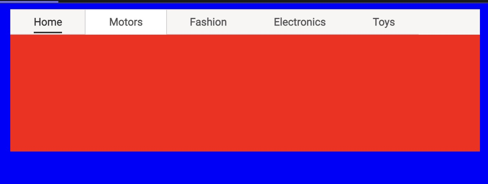
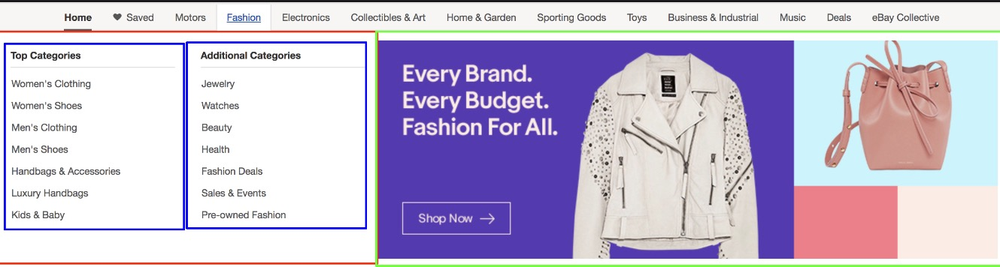

# Submenu

Each menu item has a nested menu which is called the "submenu." This lesson will briefly explain how we are going to implement it in our code.

## We'll cover the following:

- Fixing hover behavior
- Skeleton for submenu

The submenu we will be implementing appears when we hover over a menu item. It looks as if it’s extending out of the menu item, but it’s actually just an overlay that stays in the same position regardless of the hovered item. The appearance of connectivity is given by the hovered menu item background matching that of the submenu.

So with that, let’s create this overlay to show up for now. Nothing fancy, just a div with some width and height.

Something that I like to do while tweaking CSS – especially positioning and sizing – is to liberally give color to things that take up space. For example, the default white background and the overlay are similar in color (along with the menu colors), so to avoid any confusion, we’re just going to paint the background blue and the overlay red for now. This makes it abundantly clear the space that each element takes up.

### Output



```html
<html>
  <head>
    <link
      href="https://fonts.googleapis.com/css?family=Roboto"
      rel="stylesheet"
    />
  </head>
  <body>
    <div class="menu">
      <div class="menu__main">
        <div
          class="menu__main__item menu__main__item--current menu__main__item--home"
        >
          <a class="menu__main__item__link" href="#">Home</a>
        </div>
        <div class="menu__main__item menu__main__item--motors">
          <a class="menu__main__item__link" href="#">Motors</a>
        </div>
        <div class="menu__main__item menu__main__item--fashion">
          <a class="menu__main__item__link" href="#">Fashion</a>
        </div>
        <div class="menu__main__item menu__main__item--electronics">
          <a class="menu__main__item__link" href="#">Electronics</a>
        </div>
        <div class="menu__main__item menu__main__item--toys">
          <a class="menu__main__item__link" href="#">Toys</a>
        </div>
      </div>
      <div class="menu__sub"></div>
    </div>
  </body>
</html>
```

```css(scss)
body {
  background: blue;
}

.menu {
  margin: 0 auto;
  width: 40rem;
  background: #F7F6F5;
  border-top: 1px solid #CFCFCF;
}

.menu__main__item {
  display: inline-block;
  padding: 0.5rem 2rem;
  border-bottom: 1px solid #CFCFCF;
}

.menu__main__item:hover {
  background: white;
  border-bottom: none;
  border-right: 1px solid #CFCFCF;
  border-left: 1px solid #CFCFCF;
  margin: 0 -1px;
}

.menu__main__item--current .menu__main__item__link {
  color: #333333;
  border-bottom: 2px solid #333;
  padding-bottom: 0.3rem;
}

.menu__main__item__link {
  text-decoration: none;
  color: #555;
  font-family: Roboto;
  font-size: 0.9rem;
  font-weight: 800;
}

.menu__main__item__link:hover {
  text-decoration: underline;
  color: #1C60BB;
}

.menu__sub {
  width: 40rem;
  height: 10rem;
  background: red;
}
```

## Fixing hover behavior

This is a good time to bound the width of our menu and center it. Adding margin: 0 auto often does the trick for horizontal centering and will keep it centered as you increase or decrease the number of menu items. I’ve put the submenu as an element within the menu div, so there’s cohesion between elements that share similar positioning properties. If the layout requirements change in a way that we want the element to be closer to the left, I can add properties to the parent menu element instead of two different ones if I had separated them. But I don’t want it at the same level as the menu items since they’re not the same category of things, so I’ll wrap that in its own div as well and call it menu**main. Of course, this means I have to change all the previous menu**item to menu**main**item (in both the HTML and CSS).

Now that the background color is blue, it helps me notice something I hadn’t before. Upon hover, the first menu item shouldn’t be given a left border, and the last menu item shouldn’t be given a right. The border appears out of the bounds of the menu. It’s much easier to catch things like that when you have this much contrast between your elements in development.


Let’s fix that. In CSS, you can chain multiple pseudo-classes so that we can target the first with :first-child:hover and the last one with :last-child:hover. With that, we can remove the overflow behavior easily by overriding properties. In CSS, in the event of conflicting properties, the specificity of the targeting determines precedence.

```html
<html>
  <head>
    <link
      href="https://fonts.googleapis.com/css?family=Roboto"
      rel="stylesheet"
    />
  </head>
  <body>
    <div class="menu">
      <div class="menu__main">
        <div
          class="menu__main__item menu__main__item--current menu__main__item--home"
        >
          <a class="menu__main__item__link" href="#">Home</a>
        </div>
        <div class="menu__main__item menu__main__item--motors">
          <a class="menu__main__item__link" href="#">Motors</a>
        </div>
        <div class="menu__main__item menu__main__item--fashion">
          <a class="menu__main__item__link" href="#">Fashion</a>
        </div>
        <div class="menu__main__item menu__main__item--electronics">
          <a class="menu__main__item__link" href="#">Electronics</a>
        </div>
        <div class="menu__main__item menu__main__item--toys">
          <a class="menu__main__item__link" href="#">Toys</a>
        </div>
      </div>
      <div class="menu__sub"></div>
    </div>
  </body>
</html>
```

```css(scss)
body {
  background: blue;
}

.menu {
  margin: 0 auto;
  width: 40rem;
  background: #F7F6F5;
  border-top: 1px solid #CFCFCF;
}

.menu__main__item {
  display: inline-block;
  padding: 0.5rem 2rem;
  border-bottom: 1px solid #CFCFCF;
}

.menu__main__item:first-child:hover {
  border-left: none;
  margin-left: 0;
}

.menu__main__item:last-child:hover {
  border-right: none;
  margin-right: 0;
}

.menu__main__item:hover {
  background: white;
  border-bottom: none;
  border-right: 1px solid #CFCFCF;
  border-left: 1px solid #CFCFCF;
  margin: 0 -1px;
}

.menu__main__item--current .menu__main__item__link {
  color: #333333;
  border-bottom: 2px solid #333;
  padding-bottom: 0.3rem;
}

.menu__main__item__link {
  text-decoration: none;
  color: #555;
  font-family: Roboto;
  font-size: 0.9rem;
  font-weight: 800;
}

.menu__main__item__link:hover {
  text-decoration: underline;
  color: #1C60BB;
}

.menu__sub {
  width: 40rem;
  height: 10rem;
  background: red;
}
```

## Skeleton for submenu#

Next, let’s give some stubbing for text so that we can visually work with content to add styles too.

One way to determine groupings is to look at how things are splitting the parent element in one orientation. In the image below, I’ve marked up how I think of these. The red and green boxes look like a firm ratio on the horizontal space they take for the parent element, maybe 40/60. And since we always have just two columns, these split the space of the red div 50/50.



Let’s go ahead and take the approach we did implementing the top-level menu. In general, I almost always find myself taking these steps when creating new components:

- Figure out groupings
- Name classes and fill divs with text
- Switch the colors temporarily to give distinct contrast for easier styling
- Apply spacing styles in the order of outer to the inner (e.g., child divs will be styled after their parent ones)
- Switch off ugly temporary colors, use real colors, and style the rest.

We’ll use this stock image of a dog for our image, and I’ve stubbed the categories with fruits and shapes. As is, things are overflowing. Take a moment now to think about what we have to do to get these in the general layout we want.


```html
<html>
  <head>
    <link
      href="https://fonts.googleapis.com/css?family=Roboto"
      rel="stylesheet"
    />
  </head>
  <body>
    <div class="menu">
      <div class="menu__main">
        <div
          class="menu__main__item menu__main__item--current menu__main__item--home"
        >
          <a class="menu__main__item__link" href="#">Home</a>
        </div>
        <div class="menu__main__item menu__main__item--motors">
          <a class="menu__main__item__link" href="#">Motors</a>
        </div>
        <div class="menu__main__item menu__main__item--fashion">
          <a class="menu__main__item__link" href="#">Fashion</a>
        </div>
        <div class="menu__main__item menu__main__item--electronics">
          <a class="menu__main__item__link" href="#">Electronics</a>
        </div>
        <div class="menu__main__item menu__main__item--toys">
          <a class="menu__main__item__link" href="#">Toys</a>
        </div>
      </div>
      <div class="menu__sub">
        <div class="menu__sub__categories">
          <div class="menu__sub__categories__top">
            <h3 class="menu__sub__categories__header">Top Categories</h3>
            <ul class="menu__sub__categories__items">
              <li class="menu__sub__categories__item">Apple</li>
              <li class="menu__sub__categories__item">Banana</li>
              <li class="menu__sub__categories__item">Pear</li>
              <li class="menu__sub__categories__item">Orange</li>
              <li class="menu__sub__categories__item">Watermelon</li>
            </ul>
          </div>
          <div class="menu__sub__categories__additional">
            <h3 class="menu__sub__categories__header">Additional Categories</h3>
            <ul class="menu__sub__categories__items">
              <li class="menu__sub__categories__item">Circle</li>
              <li class="menu__sub__categories__item">Square</li>
              <li class="menu__sub__categories__item">Oval</li>
              <li class="menu__sub__categories__item">Diamond</li>
            </ul>
          </div>
        </div>
        <div class="menu__sub__visual">
          
        </div>
      </div>
    </div>
  </body>
</html>
```

```css(scss)
body {
  background: blue;
}

.menu {
  margin: 0 auto;
  width: 40rem;
  background: #F7F6F5;
  border-top: 1px solid #CFCFCF;
}

.menu__main__item {
  display: inline-block;
  padding: 0.5rem 2rem;
  border-bottom: 1px solid #CFCFCF;
}

.menu__main__item:first-child:hover {
  border-left: none;
  margin-left: 0;
}

.menu__main__item:last-child:hover {
  border-right: none;
  margin-right: 0;
}

.menu__main__item:hover {
  background: white;
  border-bottom: none;
  border-right: 1px solid #CFCFCF;
  border-left: 1px solid #CFCFCF;
  margin: 0 -1px;
}

.menu__main__item--current .menu__main__item__link {
  color: #333333;
  border-bottom: 2px solid #333;
  padding-bottom: 0.3rem;
}

.menu__main__item__link {
  text-decoration: none;
  color: #555;
  font-family: Roboto;
  font-size: 0.9rem;
  font-weight: 800;
}

.menu__main__item__link:hover {
  text-decoration: underline;
  color: #1C60BB;
}

.menu__sub {
  width: 40rem;
  height: 10rem;
  background: red;
}
```

We’ll use this stock image of a dog for our image, and I’ve stubbed the categories with fruits and shapes. As is, things are overflowing. Take a moment now to think about what we have to do to get these in the general layout we want.
