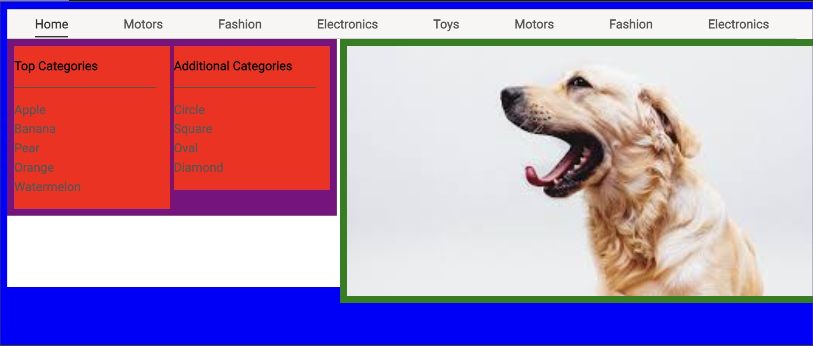
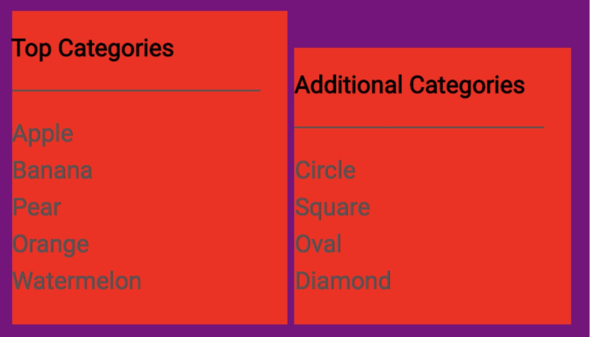
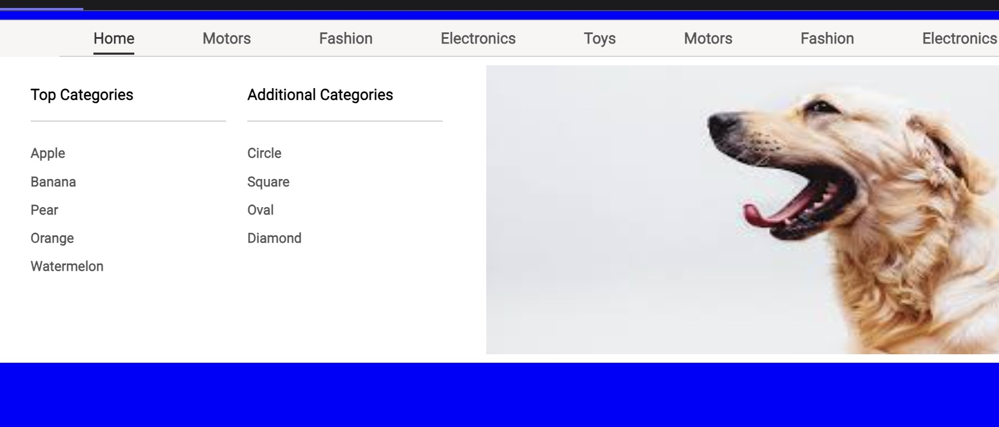

# Styling your Submenu

This lesson briefly explains how to approach styling and how to implement them via code.

We'll cover the following:

- Placement of submenu items
- Finishing off submenu styling

## Placement of submenu items#

Just like with the horizontal orientation of the top-level menu, we’ll use display: inline-block on the elements that need to line up horizontally with each other. It looks like we can use percentages for the wrapper divs that delineate text from the image – something like 40%/60%, and 50%/50% for the two inner columns. We need to size the text correctly, align it all to the left, and remove the default bullet point configuration of ul. Lastly, we can add the border to the header text and add paddings to everything.

By the way, the technique of excessively using high-contrast background colors to make elements clearer while aligning applies for inner divs just as much as the outer.



```html
<html>
  <head>
    <link
      href="https://fonts.googleapis.com/css?family=Roboto"
      rel="stylesheet"
    />
  </head>
  <body>
    <div class="menu">
      <div class="menu__main">
        <div
          class="menu__main__item menu__main__item--current menu__main__item--home"
        >
          <a class="menu__main__item__link" href="#">Home</a>
        </div>
        <div class="menu__main__item menu__main__item--motors">
          <a class="menu__main__item__link" href="#">Motors</a>
        </div>
        <div class="menu__main__item menu__main__item--fashion">
          <a class="menu__main__item__link" href="#">Fashion</a>
        </div>
        <div class="menu__main__item menu__main__item--electronics">
          <a class="menu__main__item__link" href="#">Electronics</a>
        </div>
        <div class="menu__main__item menu__main__item--toys">
          <a class="menu__main__item__link" href="#">Toys</a>
        </div>
        <div class="menu__main__item menu__main__item--motors">
          <a class="menu__main__item__link" href="#">Motors</a>
        </div>
        <div class="menu__main__item menu__main__item--fashion">
          <a class="menu__main__item__link" href="#">Fashion</a>
        </div>
        <div class="menu__main__item menu__main__item--electronics">
          <a class="menu__main__item__link" href="#">Electronics</a>
        </div>
      </div>
      <div class="menu__sub">
        <div class="menu__sub__categories">
          <div
            class="menu__sub__categories__top menu__sub__categories__category"
          >
            <h3 class="menu__sub__categories__header">Top Categories</h3>
            <ul class="menu__sub__categories__items">
              <li class="menu__sub__categories__item">Apple</li>
              <li class="menu__sub__categories__item">Banana</li>
              <li class="menu__sub__categories__item">Pear</li>
              <li class="menu__sub__categories__item">Orange</li>
              <li class="menu__sub__categories__item">Watermelon</li>
            </ul>
          </div>
          <div
            class="menu__sub__categories__additional menu__sub__categories__category"
          >
            <h3 class="menu__sub__categories__header">Additional Categories</h3>
            <ul class="menu__sub__categories__items">
              <li class="menu__sub__categories__item">Circle</li>
              <li class="menu__sub__categories__item">Square</li>
              <li class="menu__sub__categories__item">Oval</li>
              <li class="menu__sub__categories__item">Diamond</li>
            </ul>
          </div>
        </div>
        <div class="menu__sub__visual">
          
        </div>
      </div>
    </div>
  </body>
</html>
```

```css(scss)
:root {
  --dark-grey: #333333;
  --light-grey: #555;
}

* {
  font-family: Roboto;
  box-sizing: border-box;
}

body {
  background: blue;
}

.menu {
  margin: 0 auto;
  width: 60rem;
  background: #F7F6F5;
  border-top: 1px solid #CFCFCF;
}

.menu__main__item {
  display: inline-block;
  padding: 0.5rem 2rem;
  border-bottom: 1px solid #CFCFCF;
}

.menu__main__item:first-child:hover {
  border-left: none;
  margin-left: 0;
}

.menu__main__item:last-child:hover {
  border-right: none;
  margin-right: 0;
}

.menu__main__item:hover {
  background: white;
  border-bottom: none;
  border-right: 1px solid #CFCFCF;
  border-left: 1px solid #CFCFCF;
  margin: 0 -1px;
}

.menu__main__item--current .menu__main__item__link {
  color: var(--dark-grey);
  border-bottom: 2px solid #333;
  padding-bottom: 0.3rem;
}

.menu__main__item__link {
  text-decoration: none;
  color: var(--light-grey);
  font-family: Roboto;
  font-size: 0.9rem;
  font-weight: 800;
}

.menu__main__item__link:hover {
  text-decoration: underline;
  color: #1C60BB;
}

.menu__sub {
  height: 18rem;
  background: white;
}

.menu__sub__categories {
  vertical-align: top;
  display: inline-block;
  width: calc(40% - 2px);
  padding: 0.5rem;
  background: purple;
}

.menu__sub__visual {
  background: green;
  display: inline-block;
  width: calc(60% - 2px);
  padding: 0.5rem;
}

.menu__sub__visual__img {
  width: 100%;
}

.menu__sub__categories__category {
  display: inline-block;
  width: calc(50% - 2px);
  background: red;
  vertical-align: top;
}

.menu__sub__categories__header {
  font-size: 0.9rem;
  border-bottom: 1px solid var(--light-grey);
  margin-right: 1rem;
  padding-bottom: 1rem;
}

.menu__sub__categories__items {
  list-style: none;
  padding: 0;
  font-size: 0.9rem;
  line-height: 1.4rem;
  color: var(--light-grey);
}
```

In addition to the changes we discussed, there’s a few more that are worth noting:

- Define variables for shared colors
  I recognized that some of the border and text colors were the same as the ones used in the main menu. Instead of repeating the colors, I defined variables and referenced those in the places where colors were shared. Not repeating yourself is good practice even in CSS (though it’s often unavoidable)!
  How you define variables depends on which preprocessor you’re using, if any. The syntax I’ve used is for native CSS (nothing additional required).
- I had to add vertical-align: top to elements. This says that when there are two elements in the same row with heights that don’t match, we should align them according to the value in this property. Without this specification, the columns would’ve lined up like so:



- I realized that the only way to have enough room for two text columns of a reasonable font is to expand the menu like the example has it. So I just copy and pasted the elements in my HTML.
- We globally added the property box-sizing: border-box. This means that elements specified dimensions exclude padding and borders. It’s included so we can do calculations correctly. For more information, see https://css-tricks.com/box-sizing/
- To set the widths of our newly created elements, we use calc. This lets us mix different units, which is useful when we have a ratio in mind but need to use other units. In this case, we’re subtracting some pixels to make the elements line up properly in the same row.

We can now start removing the high contrast backgrounds and start making things more final.

## Finishing off submenu styling#



```html
<html>
  <head>
    <link
      href="https://fonts.googleapis.com/css?family=Roboto"
      rel="stylesheet"
    />
  </head>
  <body>
    <div class="menu">
      <div class="menu__main">
        <div
          class="menu__main__item menu__main__item--current menu__main__item--home"
        >
          <a class="menu__main__item__link" href="#">Home</a>
        </div>
        <div class="menu__main__item menu__main__item--motors">
          <a class="menu__main__item__link" href="#">Motors</a>
        </div>
        <div class="menu__main__item menu__main__item--fashion">
          <a class="menu__main__item__link" href="#">Fashion</a>
        </div>
        <div class="menu__main__item menu__main__item--electronics">
          <a class="menu__main__item__link" href="#">Electronics</a>
        </div>
        <div class="menu__main__item menu__main__item--toys">
          <a class="menu__main__item__link" href="#">Toys</a>
        </div>
        <div class="menu__main__item menu__main__item--motors">
          <a class="menu__main__item__link" href="#">Motors</a>
        </div>
        <div class="menu__main__item menu__main__item--fashion">
          <a class="menu__main__item__link" href="#">Fashion</a>
        </div>
        <div class="menu__main__item menu__main__item--electronics">
          <a class="menu__main__item__link" href="#">Electronics</a>
        </div>
      </div>
      <div class="menu__sub">
        <div class="menu__sub__categories">
          <div
            class="menu__sub__categories__top menu__sub__categories__category"
          >
            <h3 class="menu__sub__categories__header">Top Categories</h3>
            <ul class="menu__sub__categories__items">
              <li class="menu__sub__categories__item">
                <a href="#" class="menu__sub__categories__item__link">Apple</a>
              </li>
              <li class="menu__sub__categories__item">
                <a href="#" class="menu__sub__categories__item__link">Banana</a>
              </li>
              <li class="menu__sub__categories__item">
                <a href="#" class="menu__sub__categories__item__link">Pear</a>
              </li>
              <li class="menu__sub__categories__item">
                <a href="#" class="menu__sub__categories__item__link">Orange</a>
              </li>
              <li class="menu__sub__categories__item">
                <a href="#" class="menu__sub__categories__item__link"
                  >Watermelon</a
                >
              </li>
            </ul>
          </div>
          <div
            class="menu__sub__categories__additional menu__sub__categories__category"
          >
            <h3 class="menu__sub__categories__header">Additional Categories</h3>
            <ul class="menu__sub__categories__items">
              <li class="menu__sub__categories__item">
                <a href="#" class="menu__sub__categories__item__link">Circle</a>
              </li>
              <li class="menu__sub__categories__item">
                <a href="#" class="menu__sub__categories__item__link">Square</a>
              </li>
              <li class="menu__sub__categories__item">
                <a href="#" class="menu__sub__categories__item__link">Oval</a>
              </li>
              <li class="menu__sub__categories__item">
                <a href="#" class="menu__sub__categories__item__link"
                  >Diamond</a
                >
              </li>
            </ul>
          </div>
        </div>
        <div class="menu__sub__visual">
          
        </div>
      </div>
    </div>
  </body>
</html>
```

```css(scss)
:root {
  --dark-grey: #333333;
  --light-grey: #555;
  --border-grey: #CFCFCF;
}

* {
  font-family: Roboto;
  box-sizing: border-box;
}

body {
  background: blue;
  height: 500px;
}

.menu {
  margin: 0 auto;
  width: 70rem;
  background: #F7F6F5;
  border-top: 1px solid var(--border-grey);
}

.menu__main {
  width: 90%;
  margin: 0 auto;
}

.menu__main__item {
  display: inline-block;
  padding: 0.5rem 2rem;
  border-bottom: 1px solid var(--border-grey);
}

.menu__main__item:hover {
  background: white;
  border-bottom: none;
  border-right: 1px solid #CFCFCF;
  border-left: 1px solid #CFCFCF;
  margin: 0 -1px;
}

.menu__main__item--current .menu__main__item__link {
  color: var(--dark-grey);
  border-bottom: 2px solid #333;
  padding-bottom: 0.3rem;
}

.menu__main__item__link {
  text-decoration: none;
  color: var(--light-grey);
  font-family: Roboto;
  font-size: 0.9rem;
  font-weight: 800;
}

.menu__main__item__link:hover {
  text-decoration: underline;
  color: #1C60BB;
}

.menu__sub {
  height: 18rem;
  background: white;
}

.menu__sub__categories {
  vertical-align: top;
  display: inline-block;
  width: calc(40% - 1rem - 2px);
  padding: 0.8rem;
  margin-left: 1rem;
}

.menu__sub__visual {
  display: inline-block;
  width: calc(60% - 2px);
  padding: 0.5rem;
  height: 100%;
}

.menu__sub__visual__img {
  width: 100%;
  height: 100%;
}

.menu__sub__categories__category {
  display: inline-block;
  width: calc(50% - 2px);
  vertical-align: top;
}

.menu__sub__categories__header {
  font-size: 0.9rem;
  border-bottom: 1px solid var(--border-grey);
  margin-right: 1rem;
  padding-bottom: 1rem;
}

.menu__sub__categories__items {
  list-style: none;
  padding: 0;
  line-height: 1.6rem;
  color: var(--light-grey);
}

.menu__sub__categories__item__link {
  text-decoration: none;
  color: var(--light-grey);
  font-size: 0.8rem;
  font-weight: 800;
}

.menu__sub__categories__item__link:hover {
  text-decoration: underline;
}
```

Some finishing touches:

- I noticed the menu items don’t actually extend all the way to the end of the menu, so I gave the menu a bit of extra width and set width:90% and centered it on menu\_\_main. Even though it was previously unused, well-planned groupings make it easy to customize in the future!
- To have the image contained within the div, I set both width and height to 100%.
- To better target the links, I realized I should’ve wrapped the actual text of the items in each category around a <a> tag since they are links to another page.
  I think this looks pretty close to what we want the outcome to look like.
